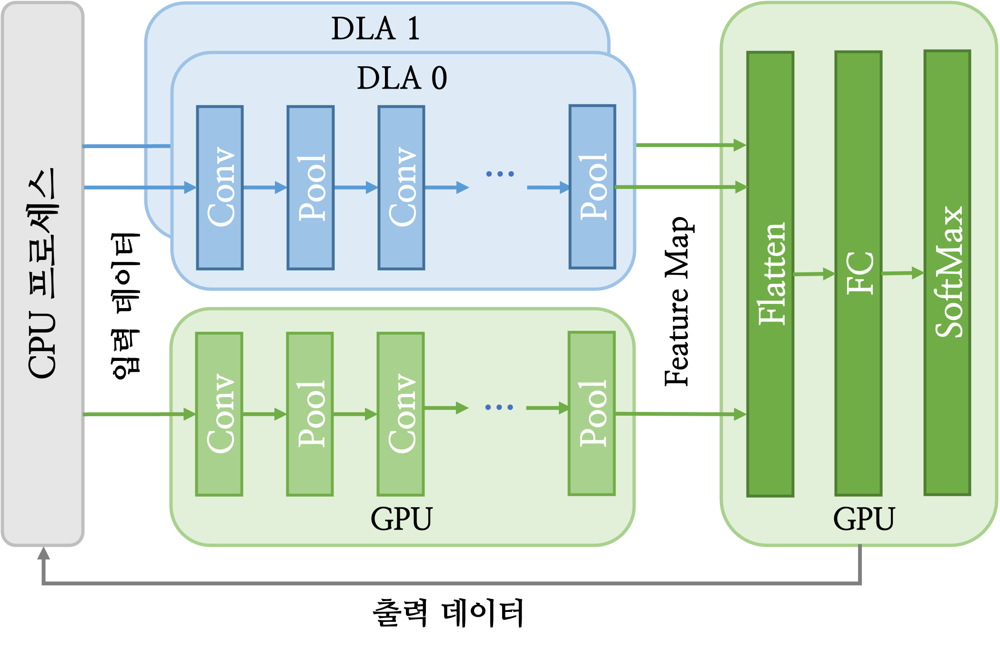
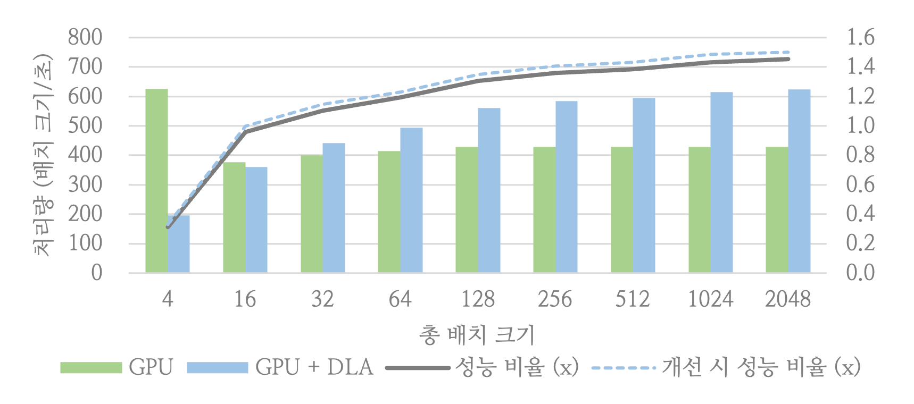

## NVIDIA GPU-DLA Parallelization
"*임베디드 디바이스의 이종 연산 장치를 활용한 협력 추론 분석 (KSC2022)*" 논문의 기반 연구 내용을 요약한 레포지토리입니다.

(이성주, 원준호, & 박영준. (2022). 임베디드 디바이스의 이종 연산 장치를 활용한 협력 추론 분석. *한국정보과학회 학술발표논문집*, 게시 예정)

 

### 목차

1. [연구 개요](#연구-개요)
2. [코멘트](#코멘트)

 

### 연구 개요

#### 배경

- 서버 대비 비교적 성능이 낮은 엣지 디바이스에서 모델 추론 시 실시간 처리 애플리케이션의 요구사항을 충족하기 어려울 수 있습니다.
- CPU 및 GPU 외에 두 개의 NVDLA 유닛이 추가로 탑재된 NVIDIA Jetson Xavier Series 임베디드 보드에서 GPU와 함께 NVDLA를 활용 가능하면 효율적인 병렬화가 가능할 것으로 보았습니다.

 

#### 제안

- 모델 전반부의 Convolution, Pooling 레이어 등의 연산은 GPU 및 NVDLA에서 대부분 잘 지원되므로, 모델 전반부의 연산은 서로 다른 입력 데이터에 대해 비의존적으로 두 유닛이 병렬적으로 수행 가능합니다.
- Fully Connected 레이어 등의 연산은 보통 NVDLA에서 지원하지 않으므로, 모델 후반부의 연산은 반드시 GPU에 의해 단독 수행 되어야 합니다.
  - 모든 입력 데이터가 해당 기기 내에 존재하여 언제든 활용 가능한 경우, 전반부에 대한 병렬 연산이 모두 완료된 이후 모든 출력 결과를 묶어 한 번에 처리하도록 할 수 있습니다.
  - 만약 네트워크를 통해 데이터를 전달 받는 경우, 데이터 통신 비용에 의해 시스템 전반에 병목이 생기지 않도록 적은 배치 크기로 주기적인 추론을 하는 것이 더 효율적일 수 있습니다.

 

#### 결과

##### 최적 병합 조합의 추론 속도 비교

- GPU 단독 사용 시 대비 DLA와 함께 병렬화 할 때, 배치 크기에 따라 MobileNet 모델 추론 시 처리량을 비교한 것입니다.
- 배치 크기가 16 이상으로 증가하면서부터 병렬화의 효율이 조금씩 좋아지기 시작하였고, 1024일 때 약 1.43배, 2048일 때 약 1.46배 가량까지 처리량이 개선된 것을 확인할 수 있었습니다.

 

#### 테스트 환경

- NVIDIA Jetson Xavier NX

  - H/W
    - CPU: Hexa Core NVIDIA Carmel ARM
    - GPU: NVIDIA Volta Architecture (384 CUDA Cores & 48 Tensor Cores)
    - DLA: 2x NVDLA Engines
    - RAM: 8GB LPDDR4x

  

  - S/W
    - JetPack with Ubuntu 18.04, Python 3.7
    - TVM 0.9.0, TensorRT

 

### 코멘트

#### 연구 동기

- 고성능 서버와 여러 임베디드 디바이스를 병렬화 시도하던 중, 임베디드 디바이스의 성능이 다소 아쉬워 여러 유닛을 활용해서라도 자체 성능을 향상할 수 있는 방법을 고민하다 NVDLA 관련 내용을 접하게 되었습니다.
- NVDLA는 TensorRT를 통해서만 사용 가능함을 알게 되었고, 기존에 활용하던 TVM 딥러닝 컴파일러가 GPU에 대한 TensorRT 백엔드를 지원함을 고려하여 NVDLA를 타겟으로 지정할 수 있도록 해당 백엔드 코드 일부를 간단히 수정하는 데에 성공하였습니다.
- 본 연구는 다음 선행 연구로부터 큰 motivation을 얻었습니다.
  - [Jeong,E.,Kim,J.,Tan,S.,Lee,J.,&Ha,S.(2021).Deeplearninginference parallelization on heterogeneous processors with tensorrt. IEEE Embedded Systems Letters, 14(1), 15-18.](https://ieeexplore.ieee.org/abstract/document/9449896/)

 

#### 개선 의견

- 앞으로 더 다양한 모델에 대해 적절한 배치 크기를 동적으로 탐색하는 로직을 적용하고 그 결과를 확인할 수 있으면 좋을 것이고, 관련 내용을 현재 진행해 보려 하고 있습니다.
